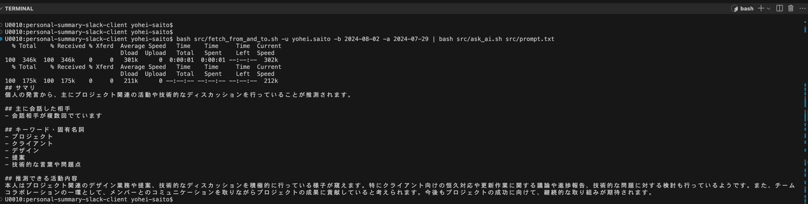

# Slack Analysis Tool: "personal-summary-slack-client"

---

## Overview

- Analyzes individual activities based on Slack conversation history
- Utilizes OpenAI API for natural language processing
- Lightweight implementation using shell scripts and jq

---

## Key Features

1. Fetch messages from Slack
2. Format and process messages
3. Analyze using OpenAI API
4. Generate activity summaries

---

##

---
