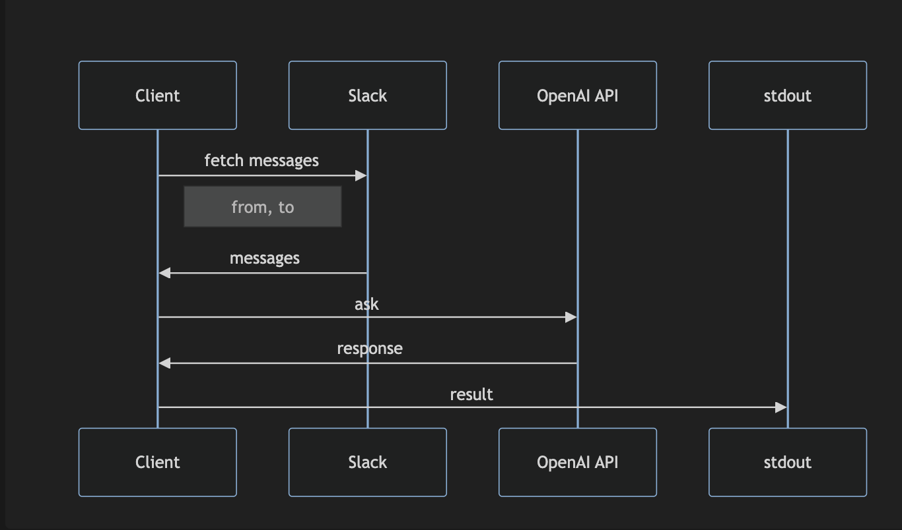
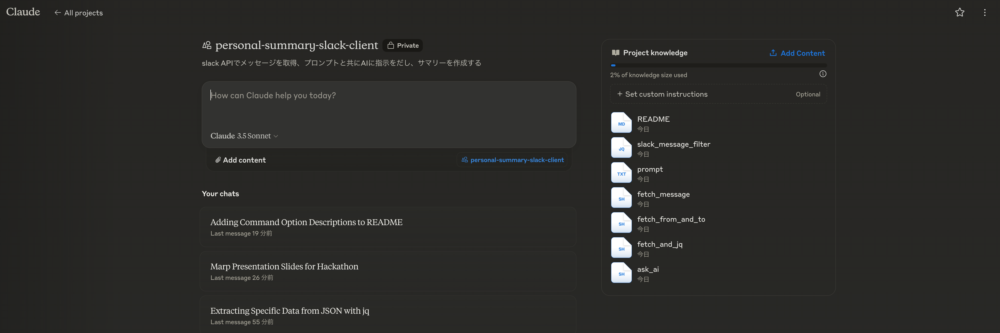

# Slack Analysis Tool: "personal-summary-slack-client"

---

## Overview

- LLMで個人の活躍をサマリ

---

##

---

## 仕組み

---

## 開発の背景

- あまりに忙しい週は、自分が何をやったか思い出せない
- みんながどんな活動に注力しているか気になる

---

## 開発過程の紹介

- Claudeをフル活用
- コードの品質を保つために[(Style Guile)](https://google.github.io/styleguide/shellguide.html)をClaudに読ませた

---

--- 
## ポイント

- 引数でユーザーと期間を指定できる柔軟で直感的なコマンド
- bash・jq・promptのみの軽量な実装
- ユーザーの発言と、ユーザーへのメンション情報を用いることで、AIが状況をより把握できる

---
